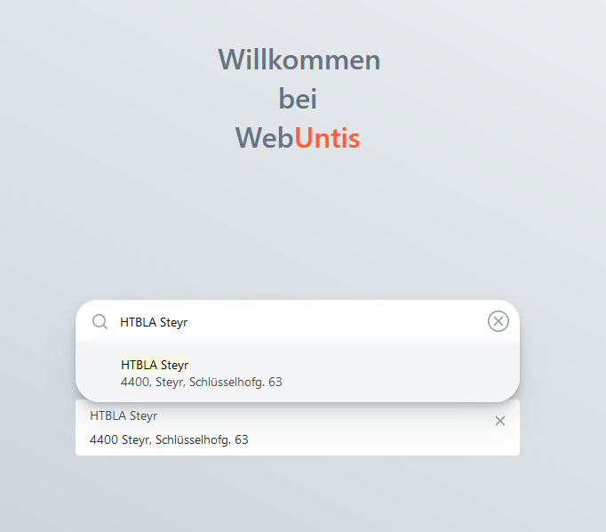
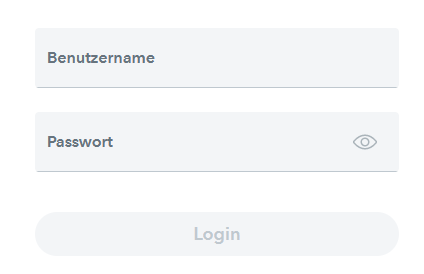
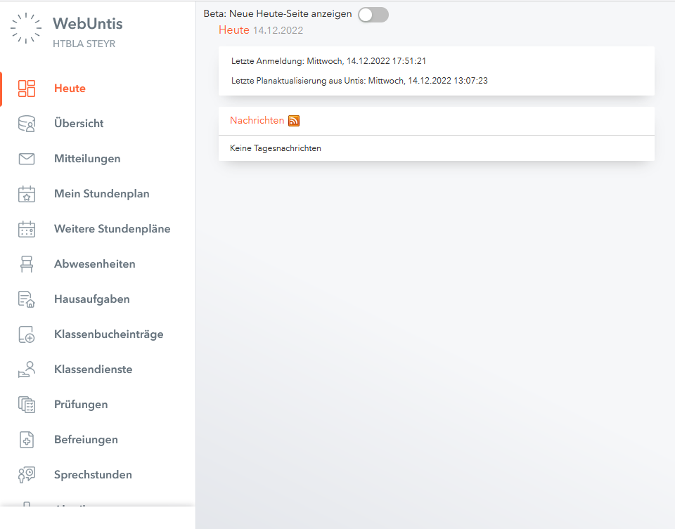
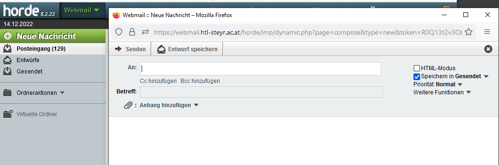
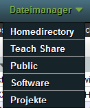
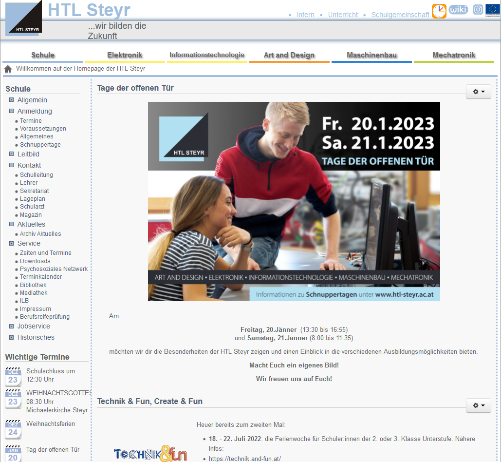
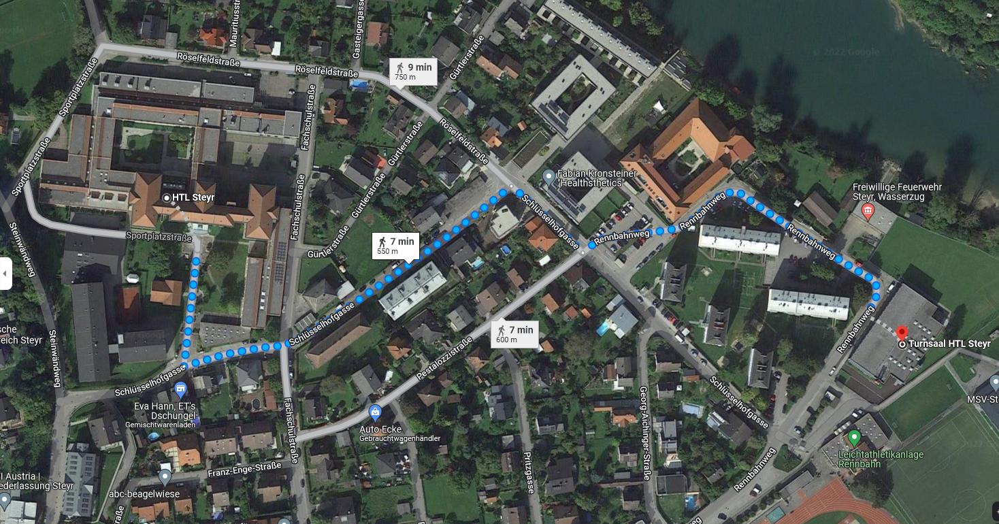

## 
> Organisatorisches
--

## Webuntis
---
## Digitales Klassenbuch
- www.webuntis.com <!-- .element: class="fragment" data-fragment-index="1" -->
- Innerhalb der ersten Schulwoche werden die Anmeldedaten für das elektronische Klassenbuch übergeben <!-- .element: class="fragment" data-fragment-index="2" -->
- Stundenpläne, Fehlzeiten, Hausaufgaben, Prüfungstermine und wichtige Informationen der Schulleitung einsehbar <!-- .element: class="fragment" data-fragment-index="3" -->
---
**Schritt 1:** Suchen der Schule im Suchfenster (HTBLA Steyr) 
 
---
**Schritt 2:** Benutze die erhaltenen Login Daten

---
**Schritt 3:** Das Hauptfenster des digitalen Klassenbuches
 <!-- .element: class="fragment" data-fragment-index="1" -->
- Übersicht: Zeigt offene Abwesenheiten und Befreiungen, sowie anstehende Prüfungen / Hausübungen an <!-- .element: class="fragment" data-fragment-index="2" -->
- Mein Stundenplan: Gibt Auskunft über den Stundenplan der gesamten Klasse <!-- .element: class="fragment" data-fragment-index="3" -->
- Sprechstunden: Zeigt eine Liste von Kontaktdaten der Lehrkräfte an <!-- .element: class="fragment" data-fragment-index="4" -->

--
## Webmail
---
## Kommunikation per Email
- **https://webmail.htl-steyr.ac.at**
    - Aufbau der Adresse: benutzername@htl-steyr.ac.at
---
## Neue Nachricht senden
**Neue Nachricht** ermöglicht das versenden von Nachrichten

---

## Datei Manager
Ermöglicht den Zugriff auf das Schulnetzwerk *von Zuhause*

--

## Webseite der HTL Steyr

---
Die Webseite ist über den Link: **www.htl-steyr.ac.at** abrufbar.

--
## Ablauf der ersten Schulwoche
---
* Der Jahrgangsvorstand übergibt sämtliche Logindaten
    * Passwörter müssen gesetzt werden <!-- .element: class="fragment" data-fragment-index="1" -->
* Einführung in die Werkstätten <!-- .element: class="fragment" data-fragment-index="2" -->
* Informationen über den Sport Unterricht <!-- .element: class="fragment" data-fragment-index="3" -->
* Eine kurze Rede der Schulleitung <!-- .element: class="fragment" data-fragment-index="4" -->
--
## Standort der Turnhalle
---

--
## Aufbau des Hauses (z.B C103)
---
* Trakt
    * A: Der Haupttrakt
    * B: Sicht des Haupteinganges der linke Trakt
    * C: Sicht des Haupteinganges der rechte Trakt

* Die erste Zahl gibt das Stockwerk des Raumes an
* Die zweite / dritte Zahl ist die Raumnummer
---
## WCs
* Befinden sich im Stiegenhaus des A Traktes 
* Bei den Werkstätten im Gang
* Im C Trakt am Weg zu den Klassen
---
## Drucker
* Bei den Werkstätten
* Im C Trakt bei den Servern, Stockwerk 1 / Stockwerk 3

--
## Elternsprechtage
---
Die Reservierung von Gesprächsterminen erfolgt über www.webuntis.com

* Eine genaue Anleitung findet man unter:
    * https://www.htl-steyr.ac.at/Downloads/022_WebUntis-Elternsprechtag.pdf

--
## Krankmeldungen
---
## Informieren
Bei Krankmeldungen ist es notwendig, dass die Erziehungsberechtigten das Sekretariat
über das Fernbleiben des Unterrichts informieren
---
Kontakt zum Sekretariat: 07252 72914

--
## Internes Schulnetzwerk
---
* Erreichbar unter: 
    * https://www.htl-steyr.ac.at/index.php/intern-sidebar
---    

---
* Gibt Zugriff auf das interne Netzwerk mit Material der Lehrpersonen
* Unter dem Reiter **Formulare** können wichtige Dateien heruntergeladen werden
