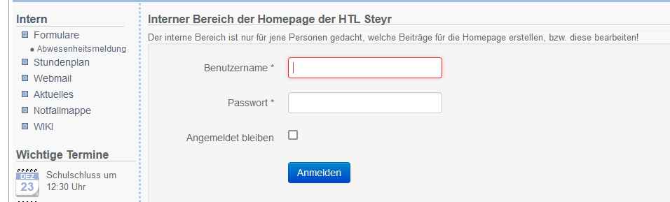

## 
> Organisatorisches
--

## Webuntis
---
## Digitales Klassenbuch
- www.webuntis.com <!-- .element: class="fragment" data-fragment-index="1" -->
- Innerhalb der ersten Schulwoche werden die Anmeldedaten für das elektronische Klassenbuch übergeben <!-- .element: class="fragment" data-fragment-index="2" -->
- Darin einsehbar: Stundenpläne, Fehlzeiten, Hausaufgaben, Prüfungstermine und wichtige Informationen der Schulleitung sind einsehbar <!-- .element: class="fragment" data-fragment-index="3" -->
---
**Schritt 1:** Suchen der Schule im Suchfenster (HTBLA Steyr) 
 
---
**Schritt 2:** Benutze die erhaltenen Login-Daten

---
**Schritt 3:** Das Hauptfenster des digitalen Klassenbuches
 <!-- .element: class="fragment" data-fragment-index="1" -->
- Übersicht: Zeigt offene Abwesenheiten und Befreiungen, sowie anstehende Prüfungen / Hausübungen an <!-- .element: class="fragment" data-fragment-index="2" -->
- Sprechstunden: Zeigt eine Liste von Kontaktdaten der Lehrkräfte an <!-- .element: class="fragment" data-fragment-index="3" -->
---
## Farben
Ereignisse werden durch Farben im Stundenplan markiert

--
## Webmail
---
## Kommunikation per Email
- **https://webmail.htl-steyr.ac.at**
    - Aufbau der Adresse: benutzername@htl-steyr.ac.at
---
## Neue Nachricht senden
**Neue Nachricht** ermöglicht das Versenden von Nachrichten

---

## File Upload
* FTP Programm: https://winscp.net/eng/download.php
* Ermöglicht den Zugriff auf das Schulnetzwerk von Zuhause aus <!-- .element: class="fragment" data-fragment-index="2" -->

---

--

## Webseite der HTL Steyr

---
Die Webseite ist über den Link: **www.htl-steyr.ac.at** abrufbar.

--
## Ablauf der ersten Schulwoche
---
* Der Jahrgangsvorstand übergibt die entsprechenden Logindaten
    * Passwörter müssen neu vergeben werden <!-- .element: class="fragment" data-fragment-index="1" -->
* Einführung in den Werkstätten Unterricht <!-- .element: class="fragment" data-fragment-index="2" -->
* Informationen über den Sportunterricht <!-- .element: class="fragment" data-fragment-index="3" -->
* Vorstellung der Schulleitung <!-- .element: class="fragment" data-fragment-index="4" -->
--
## Standort der Turnhalle
---

--
## Aufbau des Schulgebäudes (z.B A103)
---
* Trakt
    * A: Elektronik / IT
    * B: Werkstätten
    * C: Haupttrakt / Eingang

* Die erste Zahl gibt das Stockwerk des Raumes an
* Die zweite / dritte Zahl ist die Raumnummer
* z.B A101, Raum 01 im ersten Stock des A Traktes

--
## Elternsprechtage
---
Die Reservierung von Gesprächsterminen erfolgt über www.webuntis.com

* Eine genaue Anleitung findet man unter:
    * https://www.htl-steyr.ac.at/Downloads/022_WebUntis-Elternsprechtag.pdf

--
## Krankmeldungen
---
## Informieren
Bei Krankmeldungen ist es notwendig, dass die Erziehungsberechtigten das Sekretariat
über das Fernbleiben vom Unterricht informieren
---
Kontakt zum Sekretariat: 07252 72914

--
## Interner Websitebereich
---
* Erreichbar unter: 
    * https://www.htl-steyr.ac.at/index.php/intern-sidebar
---    

---
* Zugriff auf Dokumente wie z.B Schulbesuchsbestätigung
* Unter dem Reiter **Formulare** können diese heruntergeladen werden

--
## Wiki
* Schulinterne Informationen 
* Lernmaterial der Professoren
---
* Erreichbar unter:
  * http://www.htl-steyr.ac.at/intern/wiki/doku.php?id=start
---    
